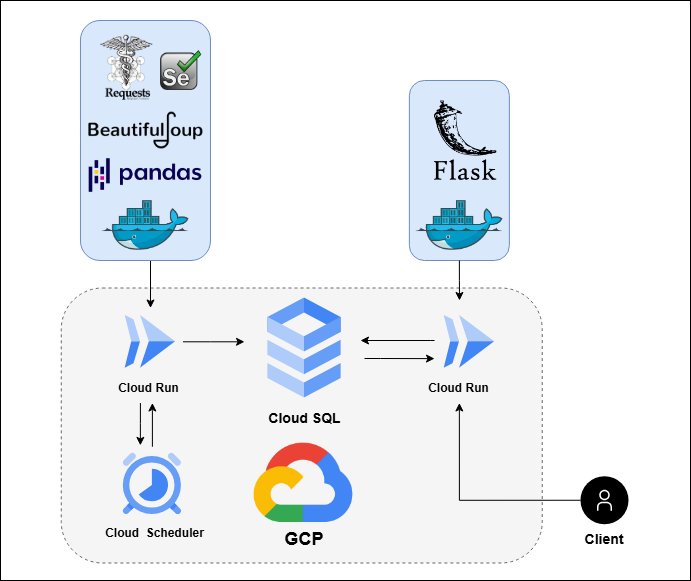

# 台南醫院即時病床資訊API
## 專案背景
隨著台南市內救護車調度的需求增加，救護人員常遇到因無法即時掌握醫院病床數而延誤病人送醫的情況。本專案旨在透過自動化爬蟲程式，定期爬取台南各家醫院的即時病床資訊，並整合成API，協助救護人員快速查詢各醫院的病床狀況，以便迅速決策。
## 主要功能
- 自動爬取台南各醫院即時病床資訊
- 整合並將病床數據存入雲端資料庫
- 提供API供外部應用查詢
- 定時更新數據，確保數據的即時性與準確性
## 技術架構
- **爬蟲技術**：透過 `requests`, `beautifulsoup` 及 `selenium` 進行網頁爬取
- **資料清理**：利用 `pandas` 整理爬取的數據
- **資料庫**：使用 `Google Cloud SQL`（PostgreSQL）儲存數據，並透過 `SQLAlchemy` 進行資料庫連線
- **API**：使用 `Flask` 框架來構建後端API服務
- **雲端部署**：使用 `Docker` 將應用容器化，並部署至 `GCP Cloud Run`，利用 `Cloud Scheduler` 定期觸發爬蟲程式更新數據
  - - -

